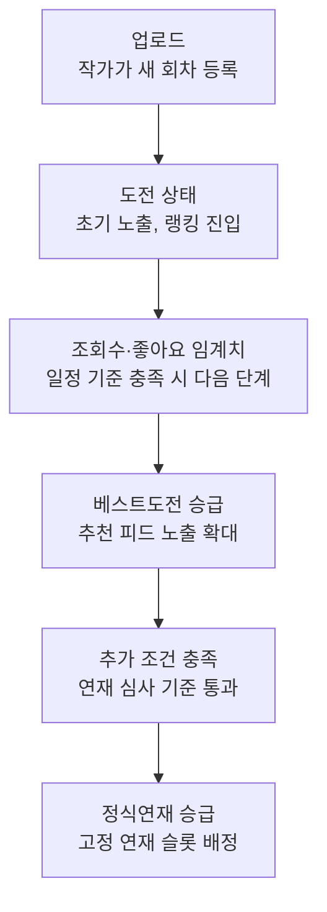
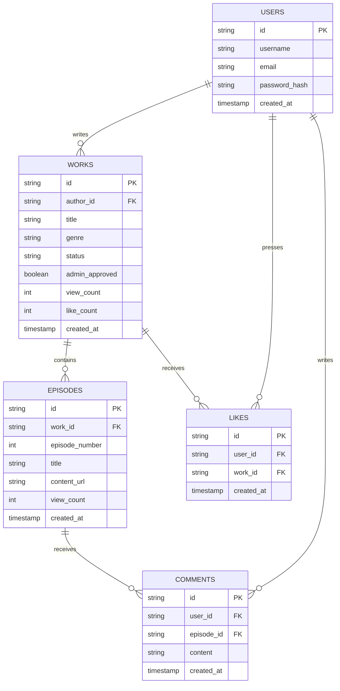

# AI 드라마 챌린지 플랫폼 — 기획 문서

> 코딩 공부용 프로젝트. 네이버웹툰 도전만화 시스템을 모델로, AI 아바타 배우가 연기하는 숏폼 드라마를 유저가 업로드하고, 조회수·좋아요·댓글로 도전 → 베스트도전 → 정식연재로 승급하는 플랫폼.
>
> MVP 범위: 실제 AI 영상 생성은 제외. 피드 + 장르 필터 + 좋아요/댓글/공유 + 랭킹 + 승급 로직 + 작품/회차 상세 페이지에 집중.

> **구현 노트**: 실제 코드에서 기획서와 달라진 부분(정식연재 조건의 평균 좋아요 계산, 개발용 기준값)은
> [`../README.md`](../README.md) 의 "기획서와 다르게 구현한 부분"에 정리해뒀다.

---

## 1. 페이지 구조

### 공개 영역 (로그인 없이 접근)

- **피드 / 탐색**: 홈피드, 장르별 피드, 검색결과, 랭킹
- **작품 상세**: 소개, 회차 목록, 상태뱃지(도전/베스트도전/정식연재)
- **에피소드 뷰어**: 본편 콘텐츠, 이전/다음 화

### 인증 필요 영역 (로그인 후 접근)

- **로그인 / 회원가입**: 진입 게이트
- **마이페이지**: 내 작품, 좋아요한 작품, 프로필
- **업로드**: 작품 등록, 회차 등록

좋아요/댓글 같은 소셜 액션은 공개 영역(작품상세, 에피소드 뷰어)에서 시도는 가능하지만, 실행 시점에 로그인 게이트로 전환된다.

---

## 2. 승급 플로우 (핵심 로직)



---

## 3. 데이터 모델



**테이블 설계 노트**

- `likes` 는 `(user_id, work_id)` 조합 유니크 제약 필요 (중복 좋아요 방지)
- `comments` 는 작품 전체가 아니라 **에피소드 단위**로 종속
- `works.view_count` / `like_count` 는 매번 세는 대신 캐시처럼 저장 → 랭킹 페이지 성능 위해
- `admin_approved`: 정식연재는 자동 승급 대신 최종 사람 검수 단계를 둠

---

## 4. 승급 기준 (점수 공식)

```
score = 조회수 × 1 + 좋아요 × 5 + 댓글 × 10
```

| 단계 | 승급 조건 | 이유 |
|---|---|---|
| 도전 → 베스트도전 | score ≥ 300, 회차 2개 이상 | 최소한의 연재 의지 확인 |
| 베스트도전 → 정식연재 | score ≥ 2000, 회차 5개 이상, 회차당 평균 좋아요 ≥ 20 | 꾸준함 + 회차별 고른 반응 확인 |
| 정식연재 최종 확정 | 위 조건 + `admin_approved = true` | 자동화로 못 거르는 부분(퀄리티, 표절) 사람이 확인 |

```javascript
// utils/constants.js
export const PROMOTION_RULES = {
  bestChallenge: { minScore: 300, minEpisodes: 2 },
  serialization: { minScore: 2000, minEpisodes: 5, minAvgLikesPerEp: 20 },
};

// utils/calculateScore.js
export function calculateScore(work) {
  return work.viewCount * 1 + work.likeCount * 5 + work.commentCount * 10;
}

export function checkPromotion(work) {
  const score = calculateScore(work);
  const { bestChallenge, serialization } = PROMOTION_RULES;

  if (work.status === '도전' &&
      score >= bestChallenge.minScore &&
      work.episodeCount >= bestChallenge.minEpisodes) {
    return '베스트도전';
  }

  if (work.status === '베스트도전' &&
      score >= serialization.minScore &&
      work.episodeCount >= serialization.minEpisodes &&
      (score / work.episodeCount) >= serialization.minAvgLikesPerEp) {
    return '대기(관리자 승인 필요)';
  }

  return work.status;
}
```

> 개발 중에는 `PROMOTION_RULES` 숫자를 작게 (`{ minScore: 5, minEpisodes: 1 }`) 바꿔서 테스트하고, 실제 운영 수치는 나중에 올릴 것.

---

## 5. 폴더 구조

### 지금 (Week1~5, StackBlitz 바닐라)

```
ai-drama-platform/
├── index.html
├── style.css
├── script.js       # 화면 그리기, 이벤트 처리
├── data.js         # localStorage 읽기/쓰기 (Week4~)
└── README.md
```

### 최종 목표 (Week6~10, React + Firebase)

```
ai-drama-platform/
├── src/
│   ├── components/
│   │   ├── common/     # Header, GenreFilter, LikeButton
│   │   ├── feed/       # FeedList, WorkCard
│   │   ├── work/       # WorkDetail, EpisodeList
│   │   ├── episode/    # EpisodeViewer, CommentSection
│   │   └── auth/       # LoginForm, SignupForm
│   ├── pages/          # Home, GenreFeed, WorkDetail, Episode,
│   │                   # Upload, MyPage, Login, Ranking, Search
│   ├── hooks/          # useAuth, useWorks
│   ├── services/       # firebase.js, worksService.js, authService.js
│   ├── utils/
│   │   ├── constants.js      # PROMOTION_RULES
│   │   └── calculateScore.js # score 계산 함수
│   ├── context/        # AuthContext (전역 로그인 상태)
│   ├── App.jsx
│   └── main.jsx
├── .env                # Firebase 키 (git 제외)
├── firebase.rules      # Security Rules
├── package.json
└── README.md
```

핵심 설계 원칙: `data.js`(localStorage) → `services/worksService.js`(Firebase)로 바뀌어도 이를 호출하는 컴포넌트 코드는 거의 안 바뀌도록, 함수 이름과 반환값 형태를 동일하게 유지한다.

---

## 6. 10주 로드맵 ↔ 구조 매핑

| 주차 | 로드맵 내용 | 폴더/파일 연결 |
|---|---|---|
| Wk1-2 | HTML/CSS | `index.html`, `style.css` |
| Wk3 | JS DOM | `script.js` |
| Wk4 | localStorage + XSS 방지 | `data.js` → 나중에 `services/worksService.js` 로 진화 |
| Wk5 | Git/GitHub + secrets hygiene | `.gitignore` 에 `.env` 등록 |
| Wk6-7 | React + 랭킹/승급 로직 + abuse prevention | `components/`, `pages/`, `utils/` 에 승급 로직 이식 |
| Wk8 | Firebase + Security Rules + env vars | `services/firebase.js`, `.env`, `firebase.rules` |
| Wk9 | 인증/권한/폴리싱 | `context/AuthContext.jsx`, `pages/Login.jsx` |
| Wk10 | 배포 (Vercel/Netlify, HTTPS, dev/prod 키 분리) | 배포 설정 파일 |

---

## 7. 현재 진행 상황

- **현재 단계**: Week 1, Day 2 (HTML/CSS — 헤더 + 장르 필터 내비게이션)
- **개발 환경**: StackBlitz (클라우드 기반, USB 불필요 — 군 사이버지식정보방 제약 대응)
